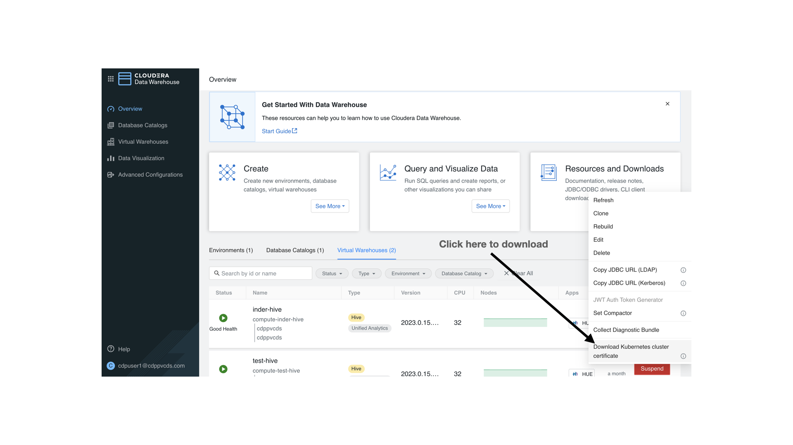
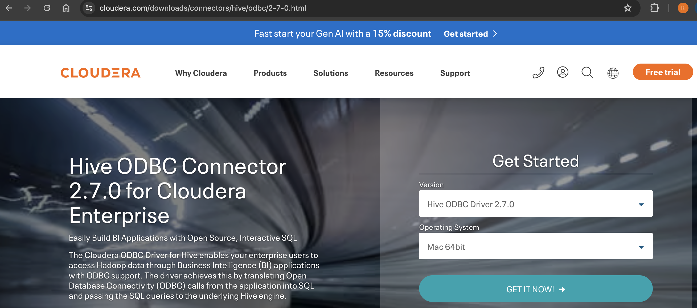

# cloudera_odbc_examples

## Connecting to a Cloudera Data Warehouse (CDW) Hive virtual instance
```
CDW exposes an SSL endpoint listening on port 443 and using a Transport Mode of HTTP. Please note that Kerberos is not required. Instead 
you authenticate to the endpoint using a username and password. The authentication is typically backed by an LDAP repository such
as Active Directory or freeIPA. There are number of certificates to download and reference in an ODBC client. The example described below
was deployed on a Mac laptop using homebrew to install the dependencies.
```
## Step 0
```
Ensure that homebrew and keytool are installed on your Mac and in your path.
% export PATH=$PATH:/opt/homebrew/bin
% which keytool
/opt/homebrew/opt/openjdk/bin/keytool
```
## Step 1

```
Assumming you have keytool installed and downloaded the certificate chain as a file and named it as truststore.jks, create a PEM file:
% keytool -list -rfc -keystore truststore.jks | sed -ne '/-BEGIN CERTIFICATE-/,/-END CERTIFICATE-/p' > cdw-certs.pem

You should see multiple certificates in this file. Please also note that the /etc/hosts file on your ODBC client should be able to
resolve the virtual URLs exposed by CDW.

keytool prompts you for a password. Here, the default password of 'changeit' was used.
```
## Step 2
```
Install the ODBC driver for use on a Mac.
% brew install unixodbc

You should now see the below on your ODBC client machine:

% ls -al /opt/cloudera/hiveodbc
total 1624
drwxr-xr-x  10 root  wheel     320 May 19 10:53 .
drwxr-xr-x   4 root  wheel     128 Dec 21  2021 ..
-rwxrwxrwx   1 root  wheel  700125 Jul  5  2023 Cloudera-ODBC-Driver-for-Apache-Hive-Install-Guide.pdf
-rwxrwxrwx   1 root  wheel   11995 Jul  5  2023 EULA.txt
drwxr-xr-x   3 root  wheel      96 Mar 31  2021 ErrorMessages
-rwxrwxrwx   1 root  wheel   22161 Jul  5  2023 Release-Notes-Hive-ODBC.txt
drwxr-xr-x   4 root  wheel     128 May 19 10:53 Setup
drwxr-xr-x   3 root  wheel      96 May 19 10:53 Tools
drwxr-xr-x   3 root  wheel      96 Mar 31  2021 lib 
-rwxrwxrwx   1 root  wheel   93490 Jul  5  2023 third-party-licenses.txt
```
## Step 3
```
Download the Cloudera ODBC Driver for Hive, e.g. try https://www.cloudera.com/downloads/connectors/hive/odbc/2-7-0.html
To ensure that the driver was installed, run:

% pkgutil --info cloudera.hiveodbc
package-id: cloudera.hiveodbc
version: 2.7.0
```

```
## Step 4
```
Locate the files used to configured ODBC Data Source Names
% which odbc_config
/opt/homebrew/bin/odbc_config

% odbcinst -j
unixODBC 2.3.12
DRIVERS............: /opt/homebrew/etc/odbcinst.ini
SYSTEM DATA SOURCES: /opt/homebrew/etc/odbc.ini
FILE DATA SOURCES..: /opt/homebrew/etc/ODBCDataSources
USER DATA SOURCES..: /Users/kdavis/.odbc.ini
SQLULEN Size.......: 8
SQLLEN Size........: 8
SQLSETPOSIROW Size.: 8
```
## Step 5
```
Configure an ODBC DSN using the paths cited in the previous step above.

% cat /opt/homebrew/etc/odbc.ini
[ODBC Data Sources]
CDW_Hive_DSN=Cloudera Hive ODBC Driver

[CDW_Hive_DSN]
Driver=/opt/cloudera/hiveodbc/lib/universal/libclouderahiveodbc.dylib
Host=hs2-test-hive.apps.cdppvcds.com
Port=443
HiveServerType=2
ServiceDiscoveryMode=0
AuthMech=3
ThriftTransport=2
HttpPath=cliservice
SSL=1
AllowSelfSignedServerCert=1
CAIssuedCertNamesMismatch=1
TwoWaySSL=0
TrustedCerts=/Users/kdavis/Documents/Partners/Protegrity/cluster-build/cdw-certs.pem
Min_TLS=1.2

For a detailed explanation of the settings above, please see an example reference doc at:
https://downloads.cloudera.com/connectors/impala_odbc_2.6.14.1016/Cloudera-ODBC-Connector-for-Impala-Install-Guide.pdf

Next, the below should be updated automatically as you install the drivers for Hive, Impala, Postgres, etc.
% cat /opt/homebrew/etc/odbcinst.ini
[ODBC Drivers]
PostgreSQL Unicode                   = Installed
Cloudera ODBC Driver for Impala      = Installed
Cloudera ODBC Driver for Apache Hive = Installed

[PostgreSQL Unicode]
Description = PostgreSQL ODBC driver
Driver      = /usr/local/lib/psqlodbcw.so

[Cloudera ODBC Driver for Impala]
Driver = /opt/cloudera/impalaodbc/lib/universal/libclouderaimpalaodbc.dylib

[Cloudera ODBC Driver for Apache Hive]
Driver = /opt/cloudera/hiveodbc/lib/universal/libclouderahiveodbc.dylib
```
## Step 6
```
Configure the system paths and environment variables.

Note that the library for the Cloudera Hive Driver is installed at:
/opt/cloudera/hiveodbc/lib/universal/libclouderahiveodbc.dylib

For convenience, use the path /usr/local/lib as a central point to reference the libraries needed:
% sudo ln -s /opt/cloudera/hiveodbc/lib/universal/libclouderahiveodbc.dylib /usr/local/lib/libclouderahiveodbc.dylib
% sudo ln -s /opt/homebrew/opt/unixodbc/lib/libodbcinst.dylib /usr/local/lib/libodbcinst.dylib

Set the following environment variables:
export DYLD_LIBRARY_PATH=$DYLD_LIBRARY_PATH:/usr/local/lib
export ODBCINI=/opt/homebrew/etc/odbc.ini
export ODBCINSTINI=/opt/homebrew/etc/odbcinst.ini
export CLOUDERAHIVEINI=/opt/cloudera/hiveodbc/lib/universal/cloudera.hiveodbc.ini
```


